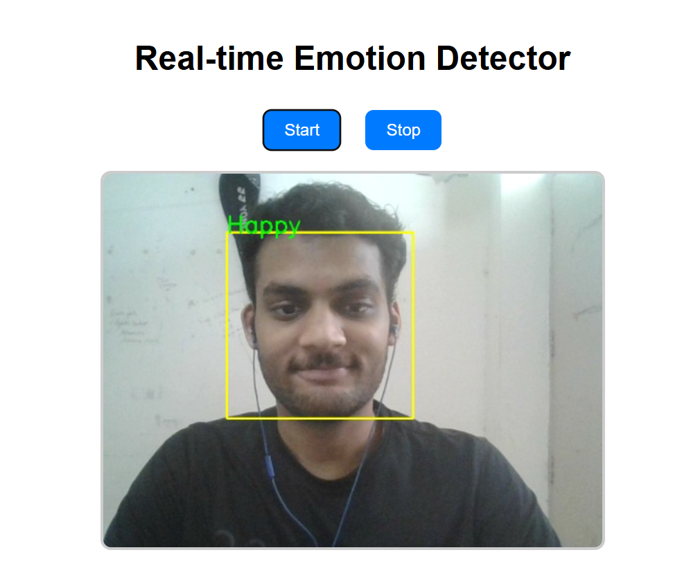
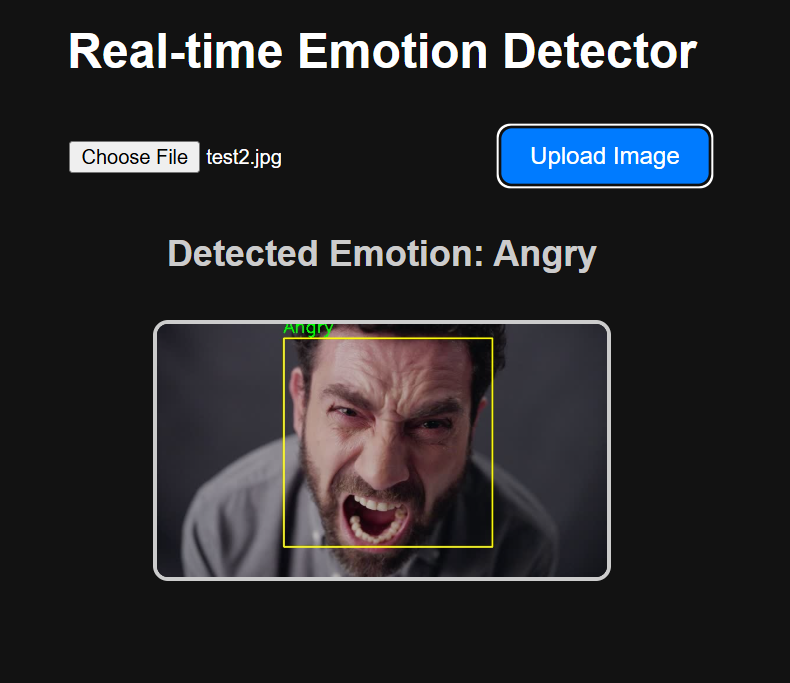

# Facial Expression Recognition using CNN

This project aims to recognize human facial expressions from grayscale images using a Convolutional Neural Network (CNN) model.

The input to the model is a 48x48 grayscale image of a face, and the output is one of the 7 emotion classes:
- Angry
- Disgust
- Fear
- Happy
- Sad
- Surprise
- Neutral

---

##  About the Model

We built a CNN model using Keras with 4 convolutional layers followed by dense layers. Here's a simple explanation of the model:


###  Model Summary:
- 4 CNN layers with increasing filters (64, 128, 512, 512)
- Dropout and Batch Normalization used after each layer
- Fully connected dense layers (256 and 512 units)
- Output layer with 7 neurons (one for each emotion)

---

##  Techniques to Avoid Overfitting

To improve the model and make it generalize better, we used:
- **Data Augmentation**: This artificially expands the training dataset by applying random transformations like rotation, zoom, shift, etc.
- **Early Stopping**: Automatically stops training when the model stops improving on validation data.
- **ReduceLROnPlateau**: Reduces the learning rate if the model gets stuck and stops improving.

---

## 📊 Dataset

We used the [FER-2013 dataset](https://www.kaggle.com/datasets/msambare/fer2013) which contains labeled facial expression images. The dataset consists of 48x48 pixel grayscale images classified into 7 emotion categories.

---

## 🖼️ Output Results

Below are some example results of how well the model performs on test images:

>  Screenshots below 👇

<p align="center">
  
  
</p>


---

## 🚀 How to Run

1. Clone this repo:
   ```bash
   git clone https://github.com/Ansh-Garg22/Facial-Expression-Recognition-Deep-Learning.git
2. On terminal Write
   ```bash
   python app.py
   python app2.py
